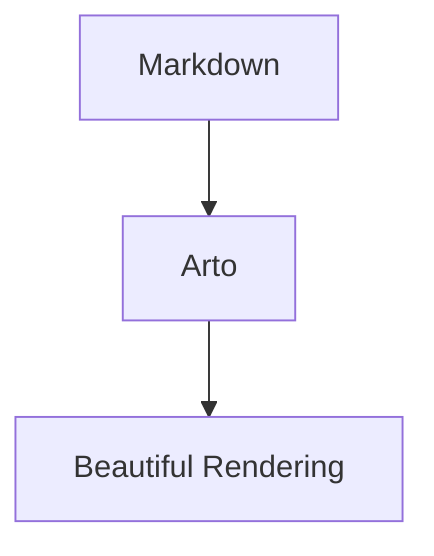

どうも、AI さんが書いた設計書とか実装計画書とかを読みまくって疲弊してるありすえです。

突然ですが、皆さんは Markdown をどうやって **読んで** いますか？

GitHub 上で README を読む。VSCode のプレビューで確認する。あるいは生のテキストをそのまま目で追う。大体この辺りだと思います。僕もずっとそうでした。でも、ずっとモヤモヤしていたんですよね。

- ブラウザで GitHub を開くとタブが際限なく増殖する
- ローカルの Markdown をサクッと綺麗に読める手段が意外とない
- オフラインで設計ドキュメントを読み返したいときに困る

「Markdown を **書く** ためのツール」は山ほどあるのに、「Markdown を **読む** ためのツール」がない。

ないなら作るか、ということで **Arto** を作りました。

https://github.com/arto-app/Arto

プロダクトサイトも用意しています。機能の一覧やスクリーンショットはこちらでも確認できます。

https://arto-app.github.io

# Arto とは

Arto は「Markdown を読む」ことに特化したネイティブアプリです。**エディタではありません。**

コンセプトは明確で、

> "Reading Markdown is not just a utility task — it's a quiet, deliberate act of understanding and appreciation."

つまり「Markdown を読むのはユーティリティ的な作業じゃない。静かに、意図的に、内容を理解し味わう行為だ」ということです。AI さんに適当に格好いいこと言わせたのをそのまま貼ってるわけですが、要するに **読むことに集中できる環境が欲しかった** んです。

Rust で書いているのでパフォーマンスは良好です。起動は一瞬、描画も軽快で、メモリ消費も控えめです。


*GitHub スタイルのレンダリングでローカルの Markdown を表示している様子*

# なぜ既存ツールではダメだったのか

ここをちゃんと書かないと「いや、VSCode でよくない？」で終わってしまうので、もう少し掘り下げます。

## ブラウザ（GitHub）

GitHub のレンダリングは綺麗です。ただ

- **オフラインで読めない**（飛行機の中とか、カフェの Wi-Fi が死んでるときとか）
- **ローカルファイルが読めない**（`git push` する前のドキュメントを確認したい）
- **タブが爆発する**（README 読んでたはずが気づいたら 30 タブ開いてる）

そもそも GitHub は「コードをホスティングするサービス」であって「Markdown リーダー」ではありません。

## エディタ（VSCode, Vim, etc.）

エディタのプレビュー機能はあくまで **書きながら確認するためのもの** です。

- カーソルが出る時点で「編集モード」の気分になる
- プレビューペインは補助的で、読書体験として設計されていない
- ファイルエクスプローラはコードを書くためのもので、ドキュメントを読み歩くには最適化されていない

## 既存の Markdown ビューア

いくつか試しましたが、

- GitHub スタイルのレンダリングじゃない（見た目が変わると読む体験も変わる）
- Mermaid や KaTeX に対応していない
- ディレクトリごと開いてファイル間を行き来できない

という感じで、どれも「あと一歩」でした。

# 機能紹介

前置きが長くなりました。ここからは Arto の機能を紹介していきます。

## GitHub スタイルのレンダリング

Arto の最大の特徴は **GitHub の Markdown レンダリングを忠実に再現している** ことです。

GitHub Flavored Markdown（GFM）の拡張構文にフル対応しています。

- テーブル
- タスクリスト
- 取り消し線
- オートリンク
- GitHub Alerts（NOTE, TIP, IMPORTANT, WARNING, CAUTION）
- YAML フロントマター（折りたたみ可能なテーブルとして表示）

普段 GitHub で見ているのと同じ見た目でローカルファイルが読めるというのは、地味ですがかなり快適です。「GitHub に push して確認」という往復がなくなります。


*テーブルやリストも GitHub と同じスタイルで表示される*


*NOTE, TIP, WARNING などの Alerts もちゃんとスタイル付きで表示*

## シンタックスハイライトとコードブロック

コードブロックは highlight.js によるシンタックスハイライト付きで表示されます。各コードブロックにはコピーボタンが付いているので、ドキュメントからコマンドやコードスニペットをサッとコピーできます。


*コードブロックにはコピーボタン付き*

## Mermaid ダイアグラム

````

````

Mermaid のコードブロックはインラインでダイアグラムとしてレンダリングされます。ここまでは他のツールでもできますが、Arto の面白いところは **ダイアグラムをクリックすると専用のビューアウィンドウで開ける** ことです。

ビューアウィンドウではズーム・パンが自由にでき、画像としてエクスポートすることも可能です。複雑なアーキテクチャ図を細部まで確認したいときに重宝します。


*Mermaid ダイアグラムをクリックするとビューアウィンドウで拡大表示できる*

## KaTeX 数式レンダリング

数式も KaTeX でレンダリングされます。インライン数式もブロック数式も対応していて、Mermaid と同様に専用のビューアウィンドウで開いて拡大表示できます。

論文や技術ドキュメントに数式が含まれているケースは意外と多いので、これも地味に嬉しい機能だと思います。


*数式もビューアウィンドウで拡大して確認できる*

## ファイルエクスプローラ

サイドバーにファイルエクスプローラを搭載しています。

- **ホバーで表示、離れたら自動で隠れる**（作業領域を圧迫しない）
- **ピン留めしてドック状態にもできる**（常に表示しておきたい場合）
- **ブックマーク機能**で頻繁に開くファイルやディレクトリに即座にアクセス

プロジェクトのドキュメントディレクトリを Arto で開いて、ファイル間を行き来しながら読む。この体験がとても良いです。


*※ ホバーでサイドバー表示は最近の機能なので、画像ではボタンクリックで表示してます*

## 目次パネル（TOC）

ドキュメントの見出しから自動的に目次を生成します。右サイドバーに表示され、クリックで該当セクションにジャンプできます。長いドキュメントの全体構造を俯瞰するのに便利です。


*見出しから自動生成される目次パネル*

## 検索機能

`⌘F` でページ内検索ができます。ここまでは普通ですが、Arto には **ピン留め検索（Pinned Search）** という機能があります。

ピン留め検索は、検索ワードのハイライトを **複数色で永続的に表示し続ける** 機能です。ドキュメントを読み進めている間もハイライトが残るので、特定のキーワードの出現箇所を追いかけながら読むことができます。

コードレビューで特定の変数名を追いかけたいときなどに地味に便利です。


*通常の検索*


*ピン留め検索で複数キーワードを色分けハイライト*

## タブ・マルチウィンドウ

複数のドキュメントをタブで開いて切り替えたり、別ウィンドウで並べて読んだりできます。まぁブラウザのタブ機能と同じ感じです。

- **タブのピン留め**（`⌥⌘P`）で重要なドキュメントを保護
- **ウィンドウ間のタブドラッグ&ドロップ**で自由にレイアウト
- **Close All / Close Others** でタブ整理（ピン留めタブは残る）
- **ドラッグ&ドロップでファイルを開く**


*複数ウィンドウでドキュメントを並べて読む*

## ダークモード

システム設定に連動するダークモードに対応しています。`⌘+` / `⌘-` でズーム調整も可能です。


*ダークモードでの表示。目に優しい*

## スマートコンテキストメニュー

右クリックメニューがコンテキストに応じて変化します。

- **テキスト選択時**: コピー、検索、ピン留め検索
- **コードブロック上**: ソースコードのコピー
- **テーブル上**: CSV / TSV / Markdown 形式でのコピー
- **画像 / Mermaid / 数式上**: 画像としてコピー・保存
- **リンク上**: URL のコピー

加えて、オリジナルファイルの場所を `/path/to/markdown.md:12` のように行付きでコピーできたりもするので AI さんに指示出しするときにも便利です。

## カスタムキーバインド

キーバインドは自由にカスタマイズ可能で、**Default / Vim / Emacs のプリセット**から選ぶこともできます。

僕は Vimmer なのでキーバインドには結構拘りを持っています。なので、例えば `<C-w>h` のようなシーケンスマッピングへの対応や「現在フォーカスされているペイン」のような機能も加えています（該当マッピングは「サイドバーへフォーカスを移動する」で、フォーカスされているペイン毎にキーバインドを割り当て可能）。

主要なデフォルトショートカットはこんな感じです。

| ショートカット | 機能 |
| --- | --- |
| `⌘O` | ファイルを開く |
| `⌘F` | ページ内検索 |
| `⌘T` | 新しいタブ |
| `⌘W` | タブを閉じる |
| `⌘B` | サイドバー切り替え |
| `⇧⌘B` | 右サイドバー切り替え |
| `⌘[` / `⌘]` | 戻る / 進む |
| `⌘R` | ドキュメント再読み込み |
| `⌘,` | 設定 |

# エディタ連携

## CLI

ターミナルから直接ファイルを開けます。Arto は **シングルインスタンスアーキテクチャ** を採用しているので、既に起動中であれば新しいプロセスを立ち上げるのではなく、既存のインスタンスにファイルが渡されます。

```bash
# ファイルを開く
arto README.md

# 複数ファイルを開く
arto file1.md file2.md

# 新しいウィンドウで開く
arto --open=new README.md

# 現在のスクリーンのウィンドウで開く
arto --open=screen README.md

# ディレクトリを指定して開く（エクスプローラのルートにもなる）
arto --directory=~/projects README.md

# ディレクトリだけ指定して開く
arto ~/projects
```

`--open` オプションでウィンドウの挙動を制御できるのが地味に便利で、マルチモニター環境で作業しているときに「このスクリーンのウィンドウで開いてほしい」というのが実現できます。

## Vim / Neovim

公式の [arto.vim](https://github.com/arto-app/arto.vim) プラグインを提供しています。

```vim
" vim-plug
Plug 'arto-app/arto.vim'

" lazy.nvim
{ 'arto-app/arto.vim' }
```

インストールすると `:Arto` コマンドが使えるようになります。

```vim
" 現在のバッファを Arto で開く
:Arto

" 指定したファイルを開く
:Arto path/to/file.md
```

Vim 9.0+ / Neovim 0.10+ で動作します。

## Emacs

公式の [arto.el](https://github.com/arto-app/arto.el) パッケージも提供しています。

```elisp
;; package-vc (Emacs 29+)
(package-vc-install "https://github.com/arto-app/arto.el")

;; use-package with vc (Emacs 30+)
(use-package arto
  :vc (:url "https://github.com/arto-app/arto.el"))
```

`M-x arto-open` で現在のバッファを Arto で開けます。`C-u M-x arto-open` でファイルを指定して開くことも可能です。

Emacs 27.1+ で動作します。

# インストール

## Homebrew（推奨）

一番簡単な方法です。

```bash
brew install --cask arto-app/tap/arto
```

:::message alert
Arto はまだ Apple の公証（notarize）を受けていません。初回起動時に Gatekeeper にブロックされる場合があります。その場合は「システム設定 → プライバシーとセキュリティ」から許可するか、以下のコマンドを実行してください。
:::

```bash
xattr -dr com.apple.quarantine /Applications/Arto.app
```

## Nix

Nix ユーザーはフレークから直接実行できます。

```bash
nix run github:arto-app/Arto
```

flake.nix に追加する場合はこんな感じです。

```nix
{
  inputs = {
    arto.url = "github:arto-app/Arto";
  };

  outputs = { self, nixpkgs, arto, ... }: {
    # nix-darwin
    darwinConfigurations.your-host = darwin.lib.darwinSystem {
      modules = [
        {
          environment.systemPackages = [
            arto.packages.${system}.default
          ];
        }
      ];
    };

    # home-manager
    homeConfigurations.your-user = home-manager.lib.homeManagerConfiguration {
      modules = [
        {
          home.packages = [
            arto.packages.${system}.default
          ];
        }
      ];
    };
  };
}
```

## ソースからビルド

開発者向けです。Rust ツールチェインと Node.js / pnpm が必要です。

```bash
git clone https://github.com/arto-app/Arto.git
cd Arto
pnpm install
cargo build --release
```

# 動作環境

| 項目 | 要件 |
| --- | --- |
| OS | macOS 11.0 以降 |
| アーキテクチャ | Apple Silicon |
| Linux | v0.24.2 から Nix 経由で初期サポート |
| Windows | 将来対応予定 |

# 技術スタック

せっかくなので裏側の技術スタックにも触れておきます。

Arto 本体は **Rust** で書かれています。Markdown のパースやレンダリング、ファイル監視、ウィンドウ管理など、コアのロジックは全て Rust です。

フロントエンド（レンダリング部分）では以下を使用しています。

- **highlight.js** — シンタックスハイライト
- **Mermaid** — ダイアグラムレンダリング
- **KaTeX** — 数式レンダリング

プロダクトサイト（[arto-app.github.io](https://arto-app.github.io)）は **HonoX**（Hono + Vite）で SSG しています。

https://github.com/arto-app/arto-app.github.io

# 今後の予定

- Linux サポートの安定化
- Windows 対応
- さらなるレンダリング互換性の向上

# さいごに

「Markdown を読む」って、考えてみると毎日やっていることなのに、そのための専用ツールがなかったのは不思議です。

Arto は「Markdown を読む」という行為を、もう少しだけ丁寧に、もう少しだけ快適にするために作りました。大げさに言えば「Markdown の読書体験」を提供するアプリです。大げさに言いすぎですね。

もし興味があれば試してみてください。Homebrew なら 1 行でインストールできます。

```bash
brew install --cask arto-app/tap/arto
```

フィードバックや Issue も歓迎です。

https://github.com/arto-app/Arto

ちなみに GitHub Sponsors もやっています。スポンサーしてくれたからといって特別なベネフィットは何もありませんが、僕の承認欲求が満たされてヤル気がガリガリ上がります。あと、ビール飲みたい。

https://github.com/sponsors/lambdalisue

