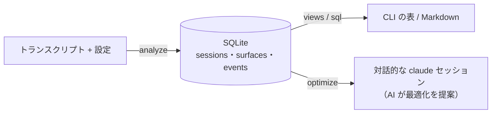
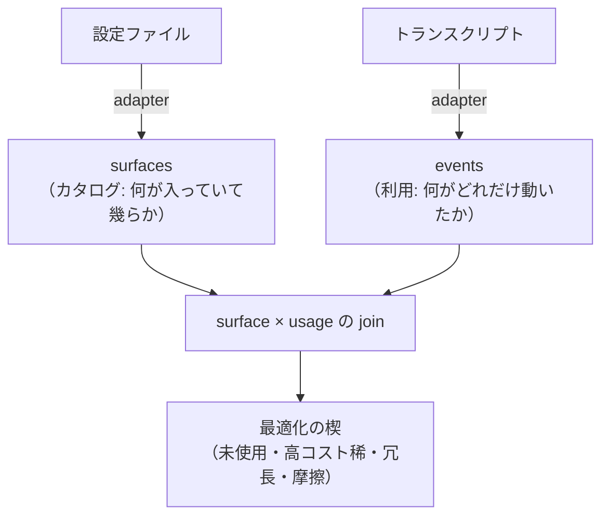
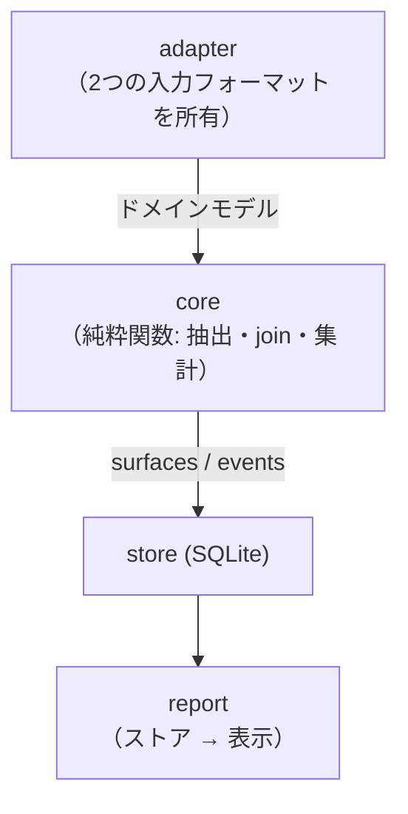

どうも、医者からアルコールを控えろと言われたのでノンアルビールを飲んでみたものの、あまり好みではなかった 16 歳（進数不明）、ありすえです。

突然ですが、皆さんは自分の Claude Code が **どれくらい無駄なことをしているか** 把握していますか？

## 設定の効果検証は難しい

AI って非決定的なツールですよね。なので、**設定の効果検証がめちゃくちゃ難しい**。

ある目的のためにルールやスキルを書いたとして、それが本当に効いてるのか？ 効いてるとして、ちゃんと効果的に効いてるのか？ これを定量的に測るのは、まあ至難の業です。結局「とりま、しばらく使って様子見」に落ち着くんですが、その「しばらく使って」がちゃんと来ることは稀で、気付いたら使われない設定だけが静かに積もっていく、という感じです。

じゃあ棚卸しするか、となっても、今度はその非決定性が逆に効いてきます。「もしかしたら自分の知らないところで効いてるのかも」と思うと、途端に消せなくなる。棚卸しそのものに、地味に心理的なハードルがあるわけです。

## これ、パフォーマンス検証にそっくりでは？

この構図、なんか見覚えあるなと思ったら、**パフォーマンスチューニング** そのものでした。

「ここにインデックスを貼れば速くなるはず」「このロジックを変えれば速くなるはず」と当てずっぽうに変更を加えて、「速くなってくれ〜」と祈る。おまけに「しばらく様子見」なんて決めた日には、その変更を **外す** という判断は輪をかけてやりにくくなる。……完全に同じ構造です。

そしてパフォーマンスチューニングの世界には、この病気によく効く有名な処方箋がありますよね。**「推測するな、計測せよ」** ってやつです。

## なので、計測する仕組みを作りました

もちろん、時間とコストをかければ計測自体はできます。設定の前後で、特定タスクの所要時間や結果の良し悪しに変化があったかを何度か測ってみれば、その設定に意味があったかは分かります。いわゆる A/B テストですね。

でも、AI って日進月歩じゃないですか。モデルの賢さも変わるし、プロンプトの解釈も変わるし、ツールの挙動も変わる。そんな状況で「この設定変更は効果的か？」をコストをかけて調査しても、**明日にはその設定の意味が無くなっているかもしれない**。しかもその調査は、時間もトークンも普通に食う。……正直、アホくさいです🙃

そこで cclens は、計測用に何かをわざわざ走らせるんじゃなくて、**普段使いのログをそのまま解析する**。そういう作りにしました。「計測のために何かコストを払う」ということをしません（もちろん解析自体のコストは発生しますが）。

これが地味に効きます。何も気にせず適当に設定をじゃんじゃん追加していって、気が向いたときに cclens で棚卸しする。そういう **雑な運用** が可能になるんです。「効果検証のために慎重に設定を足す」のではなく、「とりあえず足しておいて、あとでまとめて答え合わせ」でいい。

この「雑な棚卸し」を可能にするのが [cclens](https://github.com/lambdalisue/cclens) です。普段のセッション記録を解析して、**時間・トークン・労力がどこで無駄になっているか** を計測・可視化します（どうやって計測しているかは後半の技術詳細で説明します）。全部ローカルで完結し、データはどこにも送信しません。

https://github.com/lambdalisue/cclens

## 出来ること・使い方

cclens で出来ることは、大きく分けて 2 つです。

1. **無駄っぽいところをリストアップする**：「入れてあるのに一度も呼ばれていない設定」「コストは高いのにたまにしか使わない設定」「毎回同じ理由でコケているツール」「Claude が何度も編集し直して行き詰まっているファイル」あたりを、コスト付きでランキング表示します。
2. **詳細情報を AI に渡して、最適化を手伝ってもらう**：リストアップした findings と、それを裏付ける詳細データを AI（Claude Code 自身）に渡して、根本原因の調査から具体的な設定修正の提案までやらせます。

要するに、**「どこが怪しいか見つける」ところから「じゃあどう直すか」まで** を面倒みてくれる、というのが cclens です。以下、具体的なコマンドを順に見ていきます。

### インストール

macOS / Linux（Intel・ARM64 両対応）で動きます。Windows は面倒だったので非対応です。原理的にはサポートできないわけじゃないはずなので、欲しい人がいたら PR か issue ください。

```sh
# Homebrew
brew install lambdalisue/cclens/cclens

# Nix（ツールチェイン不要、インストールせず一発で試すことも可能）
nix run github:lambdalisue/cclens -- doctor
nix profile install github:lambdalisue/cclens
```

Rust ツールチェインがあれば `cargo build --release` でも普通にビルドできます。

### まずは `doctor` から

コマンドは色々ありますが、迷ったら **`doctor` から始めてください**。1 画面で全体の健康状態を、「グローバル（`~/.claude`）で直すべきこと」と「プロジェクトごとに直すべきこと」に分けて見せてくれる、健康診断の総合結果ページです。

```sh
cclens doctor                       # 全体のワンスクリーン健康診断（初回は自動で analyze も走る）
cclens doctor --scope global        # グローバル設定レイヤーだけ
cclens doctor --scope project:<slug> # 特定プロジェクトだけ
```

読み取り系のコマンドは、レポート前に自動でストアを最新化します（変更のないトランスクリプトはスキップされるので速い）。更新したくないときは `--frozen` を付ければ、今あるストアをそのまま読みます。

### 無駄を色々な角度から見る（Views）

`doctor` で当たりを付けたら、気になる観点を個別のコマンドで深掘りします。どれも単なる集計じゃなくて、分類や順位付け、「こう直すといい」という提案まで込みの切り口です。

```sh
cclens waste       # 最適化余地をランキング表示。削除/スリム化/トリムの推奨アクション付き
cclens inventory   # 全設定サーフェス（スコープ付き）× 実際の使用状況
cclens overhead    # セッションごとの常時オンなコンテキスト量を、設定と突き合わせて表示
cclens usage       # スキルごとの使用回数ランキング（--by month などで時間バケット別も可）
cclens failures    # ツール失敗をカテゴリ別に集計、修正案付き
cclens stuck       # Claude が短時間で何度も編集し直して行き詰まったファイル
cclens prompts     # 自分の指示の傾向（steer / correct / question / instruct の割合）
```

たとえば `failures` を見ると「うわ、このツール毎回この理由でコケてたのか」って気付けます。ルールやプロンプトを一行足すだけで消える無駄が、意外とゴロゴロしてます。`stuck` の方は Claude が堂々巡りしてるファイル、つまり指示や設計がイマイチなサインを教えてくれます。

そして冒頭で書いた「見えない固定費」に一番効くのが `overhead` です。これは、**まだ何も作業していないのに毎セッション必ず払っているコンテキスト量**（＝常時オンの床値）を見せてくれます。しかもその内訳を、

- **自分の設定ファイル由来**（`CLAUDE.md` ＋ 常時オンのルール）＝ 削れる部分
- **残り**（システムプロンプト・組み込みツール・MCP スキーマ）＝ ファイルからは削れない部分

に分解してくれるので、「太っているのは自分の設定なのか、そもそもの下駄なのか」が一目で分かります。さらにプロジェクトごとの床値も出るので、**ある MCP サーバーを有効にしているプロジェクトと、していないプロジェクトの床値を比べれば、その MCP サーバーが実際いくらのトークンを食っているか**を逆算できます。「なんとなく重い MCP」を数字で追い詰められるわけです。

`--scope` は `doctor` / `waste` / `inventory` / `failures`（と後述の `optimize`）で効きます。「不要／重い設定」はそのファイルが置かれている場所で、「繰り返す失敗」はその失敗の大半を占めるプロジェクトに、それぞれ振り分けられます（どのプロジェクトにも属さない失敗は、横断的なクセとしてグローバル扱いになります）。

### 生 SQL で自由に掘る

用意された View で足りなければ、ストアに直接クエリを投げられます。ストアは読み取り専用で開かれるので、クエリで壊す心配はありません。

```sh
# 失敗カテゴリごとの発生元ツールは？
cclens sql "SELECT category, tool, COUNT(*) n FROM tool_errors GROUP BY 1,2 ORDER BY n DESC"

# スキーマを覗く
cclens sql "SELECT sql FROM sqlite_master"
```

### 出力形式

表を出す View 系のコマンドは `--format markdown`（PR やメモにそのまま貼れる）に対応し、`--format json`（機械可読）はほぼ全コマンドで使えます（`doctor` は要約なので markdown はなく、代わりに json を吐けます）。JSON のときは stdout に JSON 以外を一切出さず、鮮度などのノイズは stderr に回します。人間向け出力はターミナルでは色付き、パイプや `NO_COLOR` で自動的にオフになります。

### そのまま直してもらう・Claude Code プラグインとして使う

見つけた無駄をそのまま直しにいくのが `optimize` です。headline な findings を、最適化アドバイザー用のプロンプトと一緒に **対話的な `claude` セッション** に手渡します。findings は一時ファイル経由で渡され、コマンドライン引数には載りません。

```sh
cclens optimize --scope global
```

ここはちょっとこだわったポイントです。日進月歩の AI を相手にするなら、**最適化そのものは AI 自身にやらせた方がいい** よな、という考えです。cclens はあくまで「計測して、確かなデータを提供する」ところに徹する。そのデータをどう調理して、どんな設定に直すかは、その時点で一番賢い AI 自身に決めさせる。だから cclens は「これを消せ」と断定はせず、材料だけ揃えて AI に渡す、という作りにしてます。

これが実際にやってみると面白くて、**自分でも気付いていなかった解決策**まで対話的に提案してくれます。僕が試したときは、こんなサジェストが返ってきました。

- **`cd` を無駄に打ちすぎ問題**：「worktree で作業しろ」というスキルを入れていたのに、そのスキルが cwd を変えていなかったせいで、Claude が毎コマンドの前に `cd` を打っていた。cclens はこれを検出した上で、「Claude Code 内蔵の worktree コマンド（cwd ごと切り替わるもの）でスキルを直せば、毎回の `cd` が丸ごと要らなくなる」と提案してくれました。
- **`awk`/`sed` 禁止ルールの過剰さ**：`awk` や `sed` を禁止するルールはちゃんと効いていたものの、実際の用途はたいてい「ファイルの部分読み込み」。なので「`perl` を案内するより、組み込みの部分読み込み機能も案内した方が筋がいい」と、ルールの書き換え方まで踏み込んで提案してくれました。

どちらも「言われてみれば確かに」なんだけど、自分ではデータを眺めていても気付きにくいやつです。計測データを AI に渡すと、こういう**一段深い最適化**が引き出せる。ここが `optimize` の一番おいしいところだと思っています。

ちなみに cclens 自体が Claude Code のプラグインマーケットプレイスにもなってて、セッションの中から呼び出すこともできます。

```
/plugin marketplace add lambdalisue/cclens
/plugin install cclens@cclens
```

導入すると `/cclens:doctor`（健康診断をセッション内で）、`/cclens:optimize`（今のセッションで根本原因を調べて具体的な修正を提案）、`/cclens:query`（読み取り専用 SQL でアドホックな質問に回答）が使えます。「Claude Code に自分の無駄を診断してもらう」という、ちょっとメタな体験ができます。

## 技術詳細

ここからは完全に中身の話なので、興味なければ読み飛ばして大丈夫です。cclens は Rust 製で、設計思想は [`docs/specs/`](https://github.com/lambdalisue/cclens/tree/main/docs/specs) に置いてあります。

### なぜ 2 ステージ + SQLite なのか

cclens は「解析（`analyze`）」と「レポート（各 View / `sql`）」の 2 ステージに分かれていて、**両者は SQLite ストアだけで疎結合** になっています。



この形にした理由はシンプルで、**入力の再パースが高すぎるから** です。トランスクリプトは数百 MB になり得ますが、分析は何度も繰り返し行うもの。なので「重い生入力は一度だけ読んでコンパクトなストアに落とし、以降のレポートはストアだけを読む」という割り切りをしています。`analyze` は増分で動くので、2 回目以降は差分だけを処理します。

コマンド名を `build` ではなく `analyze` にしているのも意図的で、「成果物をビルドする」んじゃなくて「生入力を事実へと解析する」というニュアンスですね。

### 中心にあるモデル: catalog × usage

このツールの答えは「集計」ではなく「**join**」です。

- **surface**: 設定可能なもの 1 つ（スキル、ルール、MCP サーバー…）。設定ファイルを読んで測った **静的コスト**（定義のトークン重量）を持つ。
- **event**: タイムスタンプ付きの出来事 1 つ。トークン・コンテキスト増加・実行時間といった **ランタイムコスト** を持つ。スキル呼び出しは event の一種にすぎない。



surface に対応する event が無ければ「未使用」、静的コストが高いのに event が少なければ「刈り込み候補」。この積（join）こそが最適化の楔（wedge）になります。

### レイヤー分離: フォーマット変化を 1 箇所に閉じ込める

Claude Code の入力フォーマット（トランスクリプト JSONL・各種設定ファイル）は、リリースごとに変わり得ます。そこで `analyze` の内部を、上流のフォーマット変更が **たった 1 レイヤーにしか波及しない** ように層化しています。



| レイヤー | 担当 | 知ってはいけないこと |
| --- | --- | --- |
| **adapter** | 2 つの入力フォーマットの生の形を、内部ドメインモデルへマッピング | SQLite スキーマ、コストの計算方法 |
| **core** | イベント抽出・静的コスト計量・catalog×usage の join・集計。すべて **純粋関数** | Claude Code のフィールド名や設定パス、SQL |
| **store** | `sessions` / `surfaces` / `events` を SQLite で永続化・クエリ | 生入力の形 |
| **report** | クエリ結果を表 / Markdown に整形し、楔をランキング | 生入力の形、store の API 以上の SQL |

adapter とそれ以外の契約は「内部ドメインモデル（Claude Code のリリースをまたいで安定な、ツール中心の命名）」です。上流のフィールド名が変わっても、変わるのは adapter のマッピングだけ。この境界は `.claude/rules/format-isolation.md` で明文化されていて、フォーマット変更の差分が adapter の外に漏れたらそれは境界バグ、という運用になっています。

**core を純粋関数に保つ** のもポリシーで、このツールの価値はまさに分析ロジック（イベント境界、compaction に強いコンテキスト計量、サブエージェントの帰属、catalog×usage の join）にあります。ここはバグが潜みやすくテストで縛りたいので、I/O・時計・SQL を排して、小さな合成フィクスチャで各ルールを単体テストできるようにしています。「現在時刻」やチューニング定数のような非決定性は注入します。

### 前方互換とデータの扱い

adapter は防御的にデシリアライズします。必要なフィールドだけ読み、未知のフィールドは無視し、任意フィールドの欠落も許容する。新しい Claude Code のフィールドや設定キーが増えても `analyze` を壊さない、という方針です。

そしてデータについて。cclens は生のトランスクリプトや設定を **リポジトリにもストアにもコピーしません**（`.claude/rules/session-data-privacy.md`）。Claude Code が置いた場所を読み取り専用で読むだけです。ストアはあくまで再生成可能なキャッシュで、スキーマが変わった場合は古いファイルの利用を拒否してヒントを出すので、`cclens.db` を消せば次回読み込み時に作り直されます。

なお実装の都合として、`rusqlite` は 0.32 にピン留めしています（新しい `libsqlite3-sys` がまだ unstable な `cfg_select` を使っていて stable Rust でビルドできないため）。この辺の生々しい判断は `Cargo.toml` のコメントに残してあります。

## おわりに

cclens は、自分の Claude Code の使い方を客観的に棚卸しするためのツールです。溜まった無駄を削って、時間・トークン・労力のロスを減らす。それだけです。AI 駆動開発って放っておくと設定がどんどん太っていくので、定期的な健康診断は思った以上に効きます。

全部ローカルで完結するので、まずは気軽に、

```sh
cclens doctor
```

から始めてみてください。自分の設定がどれだけ太っていたか、きっと驚くと思います。

バグ報告・要望・スターはこちらまで。

https://github.com/lambdalisue/cclens

## スポンサー

GitHub Sponsors もやっています。スポンサーしてくれたからといって特別なベネフィットは何もありませんが、僕の承認欲求が満たされて、こういうツールを作るヤル気がガリガリ上がります。

https://github.com/sponsors/lambdalisue

---

あと、冒頭でも書いた通り、僕は今ノンアルビール難民です。**クラフトビール好きに刺さる、美味しいノンアルビールを知っていたら、ぜひ教えてください。**
