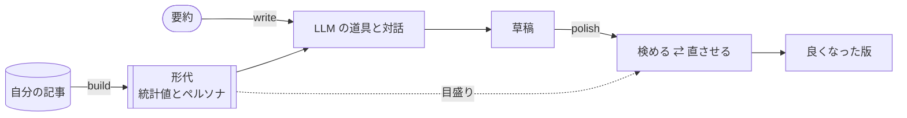
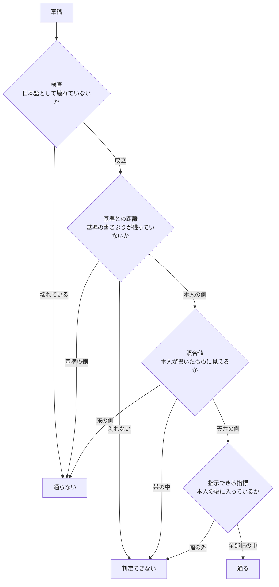
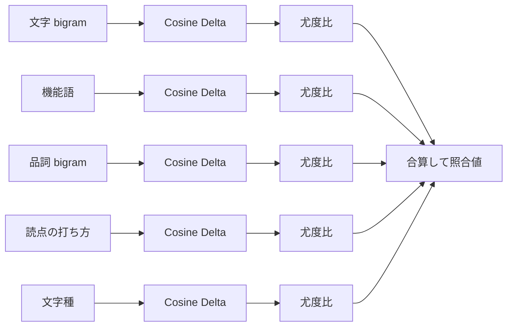
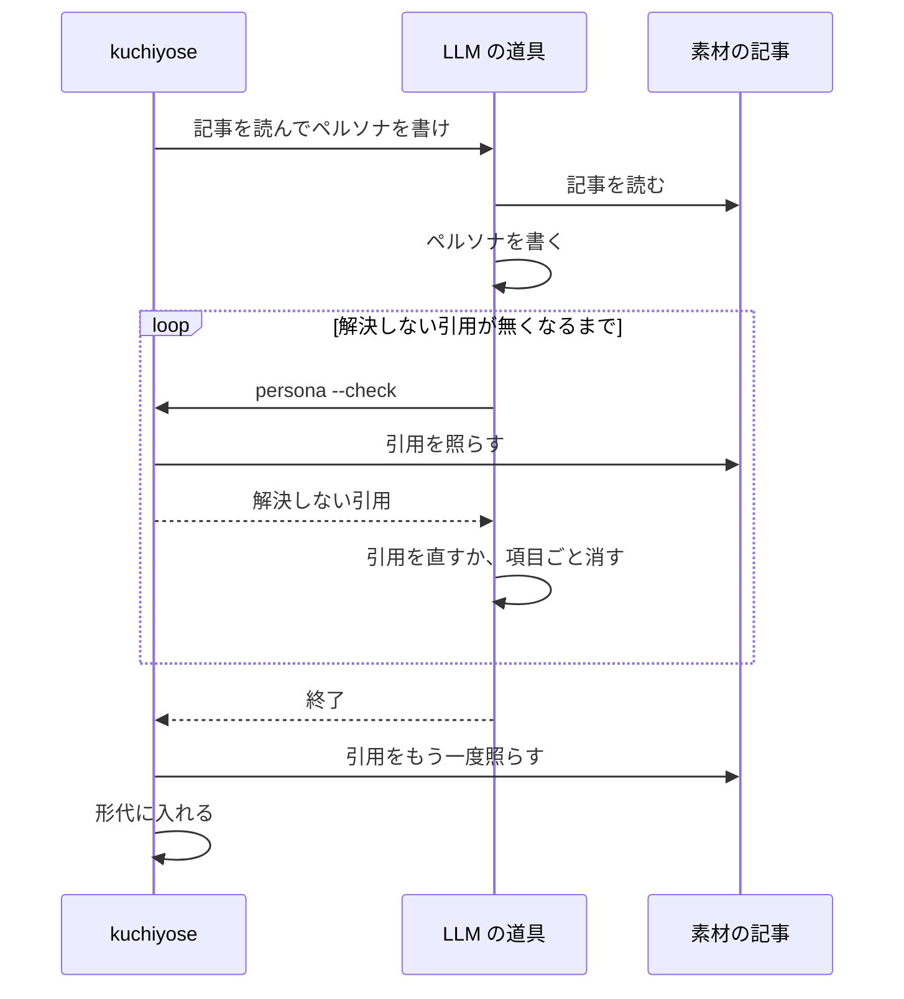
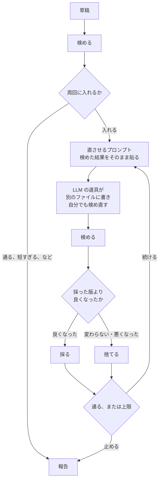

どうも、最近はプログラムを全然書いていないありすえです。

今回は LLM に自分の文章を代筆させるための CLI を作ったので、その紹介です。名前は kuchiyose（口寄せ）です。日本語の文章に特化しています。

先に断っておきます。僕は自然言語処理の専門家ではありません。統計の扱いや判定の閾値には暫定の値がいくつも残っているので、そのあたりは話半分で読んでください。確かめたのもまだ僕自身の記事だけです。ほかの書き手で同じように働くかは分かりません。

## 何がしたかったのか

LLM に記事を書かせると、読めば「これは僕の文章じゃないな」と分かります。分かるのですが、どこが違うのかと聞かれると言えません。語尾なのか。読点の打ち方なのか。言い回しなのか。直してと頼もうにも何を直せばいいのか自分でも言えないわけです。

そこで違うところを数えることにしました。数えられればどこを直すかを LLM に言うことができます。

## kuchiyose がやること、やらないこと

kuchiyose そのものは LLM の API を呼びません。やるのは以下の 2 つだけです。

- 書かせるためのプロンプトを作る
- 書けた文章を数えて検める

実際に書くのは手元の `claude`（Claude Code）や `codex`（Codex CLI）です。kuchiyose がやるのは作ったプロンプトでそれらを起動するところまでです。`PATH` に `claude` があれば `claude` を利用します。無ければ `codex` を利用します。

検めるところで数えるのは読まずに数えられる量だけです。語や句読点の頻度と文の長さと表記の揺れなどです。LLM に採点させていないので同じ草稿からは毎回同じ結果が出ます。ここは譲れないところでした。

## 使い方

使う人が打つのは基本的に以下の 3 つだけです。順に見ていきましょう。



### `kuchiyose build`：形代を作る

```sh
kuchiyose build ~/articles
```

自分の書いた記事を 1 か所に入れて渡します。目安は 10 本以上です。1 本あたりの地の文は 1,000 字以上が目安です。

`build` は記事を 1 本ずつ数えて書きぶりの統計値を取ります。続けて LLM の道具に記事を読ませてペルソナを書かせます。ペルソナに書かせるのは、何を大事にするか、読み手、話の運び方、書かないこと、よく扱う領域です。

ペルソナの項目には記事からの引用を付けさせています。LLM はそれらしい引用をさらっと捏造します。なので、引用が本当に記事にあるかを kuchiyose が文字列で確かめています。記事に無ければ「解決しない引用」と言われます。どう確かめているかはあとで書きます。

統計値とペルソナは「形代（かたしろ）」という 1 つのファイルに入ります。記事の本文は入りません。

### `kuchiyose write`：代筆させる

```sh
kuchiyose write "Vim の Denops でファイラーを作った話"
```

書きたいことの要約を渡すと LLM の道具が対話の画面で起動します。渡すプロンプトには以下のものが入っています。

- ペルソナ
- 形代から取り出した文体の事実（敬体か常体か、一人称、よく使う言い回しとその上限、長さ）
- LLM が素で書くとよく出てきて、本人は使わない言い回し
- 要約

いきなり書かせはしません。まず道具と対話して中身を決めてから草稿を書かせます。何を誰に向けてどういう順で書くか。そこは僕が決めたいのでそうしています。

### `kuchiyose polish`：表現を寄せる

```sh
kuchiyose polish draft.md
```

草稿を検めて、指摘されたところを LLM に直させます。内容は変えさせません。直した版は検め直して、良くなったときだけ採ります。良くならなければ捨てて前の版から続けます。これを通るまで回します。既定では 4 周で止まるようになっています。

検めた結果はたとえば以下のように返ってきます。

```
判定: 通らない
止まった段: 基準との距離
理由: 基準の書きぶりが残っている

人らしさの直し方 1 本
  - 句読点の密度で見た基準との距離が本人より近い（この文章 -0.125 / 本人 1.188）。
    文を繋いで長くし、読点を減らす。基準との距離が +1.140 動く。
```

ここでいう「基準」は既定では素の LLM が書いた文章です。基準との距離は正なら本人の側を指します。負なら基準の側を指します。この出力をそのまま LLM に渡して直させています。

なお、`write` は対話が終わるとそのまま `polish` と同じ周回に入ります。`polish` は自分で書いた文章やほかで書かせた文章の表現だけを寄せたいとき用です。

## 検めの中身

ここからは中の話をしましょう。

### 段を順に通す

検めは以下の段を上から順に通します。どこかで止まったら奥の段は見ません。



先の 2 段は欠陥を落とす段です。本人らしさを見るのは奥の 2 段です。順を逆にすると、機械臭いまま語の頻度だけ寄せた文章が「本人らしい」で通ってしまいます。照合値は語の頻度を寄せれば上がります。なので、読みづらさの元を先に落としています。

返すのは 通る / 通らない / 判定できない の 3 値です。筆者識別の研究にならって測れなかったことを「通らない」に混ぜないようにしています。1,000 字に届かない文章は段の値が出ません。なので「短すぎて測れない」と言って止まります。

最後の段だけ行き先が違うのには理由があります。ここまで来た文章は照合値で見ると本人の範囲に入っているからです。細く切った 1 つの指標でそれを覆すほどの根拠はありません。なので「通らない」ではなく「判定できない」を返して、外れた指標を次の周回に回します。

### 照合値は系統ごとに尤度比にしてから足す

照合値は 2 本の文章が同じ人のものに見えるかを 1 つの数にしたものです。数える系統は文字 bigram、機能語、品詞 bigram、読点の打ち方、文字種です。記号・語・品詞・表記と見ているところが偏らないように選んでいます。

系統ごとの距離は Cosine Delta で取っています。次元ごとに z 得点にしてその z 得点どうしの cosine 距離を取るものです。z 得点の平均と標準偏差は基準の文章から最初に 1 度だけ取って固定します。草稿を見てからもう一度取ることはしません。

面倒なのは系統ごとの距離をそのまま足せないところです。500 次元の系統と 10 次元の系統では尺度が違います。そのまま足すと勝手な重みで混ざります。そこで系統ごとに「同じ人の対」と「違う人の対」の距離の分布をロジスティック回帰で当てはめます。距離を尤度比に変えてから合算しています。こうするとどの系統も「同じ人である見込みが何倍か」という同じ単位になります。



これは手元でも効き目を確かめています。等しい重みで平均すると、寄与の少ない系統を足すほど本人と基準の隙間が狭まりました。較正してから足すと狭まりませんでした。

### 天井と床のあいだに帯を置く

照合値は点だけでは読めません。0.5 が近いのか遠いのかを言うには比べる先が要ります。

天井は本人の記事どうしの照合値が取る範囲です。床は基準の文章の照合値が取る範囲です。どちらも分布なので判定に使う端は刈って持ちます。天井の下端は 25 パーセンタイルです。床の上端は 75 パーセンタイルです。最小値や最大値で決めると素材を足すごとに端が外へ広がって帯が動くからです。

判定できない範囲は 2 つの分布が重なっているか離れているかで変わります。以下の図のとおりです。


分離しているときも以前は隙間を丸ごと「判定できない」にしていました。ところが別に取っておいた本人の記事 22 本で数えると、隙間を丸ごと帯にすると 11 本しか通りませんでした。真ん中で割ると 20 本が通りました。機械の文章が通ってしまったのはどちらも 0 本です。隙間が重なりでない以上、捨てていたのは安全ではなく感度だったわけです。

### 分けていない次元は足さない

基準との距離も作りは同じです。圧縮率、短い繰り返し、長い繰り返し、語彙の豊富さ、エントロピー、句読点の密度を本人の側と基準の側の境目に照らして 1 つの数にしています。

ここで一度ハマりました。直し方の先頭にずっと「語彙の豊富さ」が居座っていて、何度直しても値が動きません。調べると本人と機械を 1 本ずつ並べて機械のほうが高く出る割合（AUC）が 0.541 でした。ほぼコイン投げです。同じ素材で圧縮率は 0.768 あります。なのに当てはめた重みは語彙の豊富さのほうが語のエントロピーの約 11 倍ありました。次元どうしが相関していると回帰は分けていない次元にも大きな傾きを置くことがあります。


一番分けていない次元に一番大きな重みが付いていました。道具の言うとおりに直すほど遠回りしていたわけです。

なので、今は AUC が 0.5 から 0.1 以上離れていない次元は傾きを 0 にしています。傾きの大きさでは判断しません。これを入れたらそれまで基準との距離で止まっていた周回が初めて次の段へ進みました。

## 引用の捏造を落とす

ペルソナの引用は形代に入れるときに記事と照らしています。規則は以下のとおりです。全部決定的です。

- 名指しした記事を正規化したあとの 1 つの node（段落や箇条の項目）に、部分文字列として現れること
- 空白類の並びは 1 つの空白として比べ、ほかは 1 文字も変えない
- 途中を `…` で省いた引用は解決しない
- 地の文の日本語で 8 字以上であること

8 字の下限を置いたのは、8 字に届かない引用はどの記事にも出てくるからです。どの記事にも出てくる引用では確かめたことになりません。「読み手に分かりやすく書く」などの誰にでも言える項目はその人の記事から引けません。引ける項目だけ残せばペルソナが記事に根を持つ、という狙いです。

作らせ方にも少し工夫があります。LLM の道具には `katashiro persona --check` というコマンドだけを渡しています。確かめるだけで何も書かないコマンドです。解決しない引用があれば道具が自分で直すか項目ごと消して、もう一度確かめます。形代に入れるのは道具が終わったあとに kuchiyose がやります。道具に形代を直接書く道を渡さずに済みます。コマンドを叩けない道具でもファイルさえ書けばペルソナが入ります。



ただ、確かめられるのは引用が記事にあることまでです。引用が項目を支えているのかは分かりません。項目がその人の考えとして正しいかも分かりません。そこは本人が読むしかありません。

## なぜペルソナと周回を分けたのか

最初は、ペルソナや例文をプロンプトに入れれば書きぶりも寄るだろうと思っていました。そうはなりませんでした。

先行研究を読むとプロンプトにペルソナや例文を入れても表面の書きぶりは少ししか動かないことが報告されています（Sawant, 2026, arXiv:2604.26460）。書かせ方を 4 通り比べても本人との一致は最大で 0.024 しか動かなかったそうです。どれも赤の他人どうしより本人から遠かったそうです。一方で LLM の草稿を書いたあとに直す作業のほうは、本人の文章との一致が良くなることが測られています（Post-Editing の研究、arXiv:2604.24444）。

なので、kuchiyose では役割を分けました。

- ペルソナは内容と構成と考え方に効かせる
- 表面の書きぶりは、書いたあとに数えて直させる周回で寄せる

ペルソナを入れるより、周回を安く速く回すほうが効くと思います。

## 周回で採る版の決め方

周回は LLM の道具に任せていません。1 周ごとに kuchiyose が道具を対話なしで起動して直させます。kuchiyose が検めて採るかどうかを決めます。道具に回させると検めを飛ばすことがあります。良くなったかを LLM が決めることもあります。内容まで変えることもあります。それが起きても止められません。

目盛りは周回の最初に 1 度だけ組み立てます。全部の版に同じ目盛りを当てています。版ごとに組み立て直すと版どうしを比べられなくなります。



採るかどうかはそれまでに採った版と以下の順に比べて、最初に差が付いたところで決めます。

| 順 | 比べるもの | 良いほう |
| --- | --- | --- |
| 1 | 判定 | 通る ＞ 判定できない ＞ 通らない |
| 2 | 止まった段 | 奥の段 |
| 3 | 使いすぎ | 本人の上限を超えた言い回しを増やしていないほう |
| 4 | 止まった段の量 | 基準との距離や照合値なら大きいほう、検査や指標なら外れた本数が少ないほう |
| 5 | 判定を止めない知らせ | 上限より多く使った言い回しが少ないほう |
| 6 | どれも同じ | 採らない |

止まった段の量より先に使いすぎを見るのは、基準との距離が同じ言い回しを重ねれば安く上がるからです。量だけを見ると、本人の上限を超えるほど語尾を揃えた版が採られてしまいます。

### 直させるプロンプトに載せるもの

直させるプロンプトには、検めた結果のほかに以下を載せています。

- 捨てた直し：前の周で何を変えて、なぜ採らなかったかです。載せないと、道具は同じ版に同じ指摘で同じ直しを繰り返します。
- 言い回しの上限：今の版がよく使う言い回しについて、本人の上限と今の回数を並べます。使いすぎの知らせは超えてからしか出ないので、超える前の余地を先に見せます。
- 語を揃える指示：基準との距離で止まっているときだけ出します。この段で残る指摘は繰り返しの量と語の散り方で、文章全体に広く散っています。数か所を直しても動きません。なので、指示語を指すものに置き換え、同じものを同じ語で呼ぶ直しを文章全体に許します。文末を揃えて繰り返しを稼ぐことは禁じています。

直し方の中には、次元ごとに向きが違う指標もあります。たとえば句読点の密度は、僕の場合は句点が多く、読点が少ないほうが本人の側です。指標としては向きが割れるので、「句点を増やし、読点を減らす」と次元ごとに言います。

### 道具にも自分で検めさせる

周の中で、道具は自分の書いた版に `kuchiyose review` を打てます。直して、検めて、悪くなっていたら戻す、を 1 周の中で何度か回せます。1 回起動するごとに受け取る手がかりが増えるので、少ない周で済みます。

打てるのは、周回と同じ形代と基準を渡した `review` と、値を全部出す `review --values` だけです。回数にも上限を置いています。採るかどうかは、道具の検めではなく kuchiyose が自分の検めで決めます。

自分で検めさせると、道具は文末を揃えて稼ぎにいきます。なので、語を揃える指示の「文末を揃えない」と必ず組み合わせています。

同じ出来なら採りません。元の文章に近いほうが内容を保っている見込みが高いからです。値は丸めずに生のまま比べています。

字数が足りずに測れなくなった版はほかを比べずに捨てます。直させた結果として測れなくなったのは、内容を削ったか壊したかのどちらかだからです。捨てた版から続けることもしません。捨てた版の指摘で直させると悪くなった方向をさらに進めることになります。

止めるのは採った版が通ったとき、上限の周回数に達したとき、道具が失敗したときです。捨てた周も 1 周と数えます。上限は道具を起動する回数です。道具を起動する回数がそのまま費用の上限になるからです。

## 道具の指示が生む抜け道

作っていて一番面白かったのはここです。道具が「こう直せ」と言うと LLM はそのとおりに従います。ときには言われた以上に従います。

### 空白を増やせと言ったら、日本語を壊して通った

文字種の指摘で「空白を増やす」と出しました。すると直す側は和欧間だけでなく和文どうしにも空白を入れてきました。`複数の リポジトリ を扱う` などの文です。

| | 照合値 | 判定 |
| --- | --- | --- |
| 和文どうしに 111 箇所の空白を入れた草稿 | 2.911 | 通る |
| その空白を消した同じ草稿 | 2.632 | 判定できない |

通った分は壊れた空白が稼いでいました。指標は上がりました。日本語は壊れました。道具はそれを通しています。自分で掘った穴に自分で落ちた形ですね。

これが日本語として壊れていないかを見る検査を段の一番手前に置いた理由です。この段は形代を見ません。日本語として成立しているのかは書き手の性質ではありません。なので指標の定義が持つ固定の線と比べています。

### 繰り返せと言ったら、7 倍入れた

基準との距離を広げる直し方には「本人が現に繰り返している言い回しを、そのまま繰り返す」というものがあります。言われたほうはやりすぎます。

本人が 42 本の記事で 25 回しか使わない「ことができます」を、直した 1 本に 11 回入れてきました。1,000 字あたりにすると本人の上限 0.3 回に対して 2.1 回です。7 倍です。日本語としては壊れていないので検査では止まりません。

なので、言い回しごとに「本人の記事での 1,000 字あたりの最大」を上限として持つようにしました。上限より多ければ指摘に出します。最初は上限の 2 倍より多ければ、にしていたのですが、本人の上限 1.9 回に対して使いすぎた草稿が 2.6 回という例を捕まえられませんでした。今は 1 倍です。


これで解決したと思っていたらまだ穴がありました。上限を見ていたのが「道具が繰り返せと勧めた言い回し」だけだったのです。本人が 49 本中 6 本でしか使わない語尾を、直した 1 本に 6 回入れた例が出ました。勧めた言い回しではないので道具は黙っていました。基準との距離を広げるには語尾を揃えるのが一番安い手です。なので直す側は勧められていない語尾でも足してきます。

今は草稿が繰り返している言い回しを全部本人の上限と照らしています。問題は語そのものではなく濃さでした。

## 形代は人に渡せる

形代はただのファイルなので人に渡せます。渡された人は `--katashiro` でその形代の持ち主に寄せた代筆をすることができます。

```sh
kuchiyose write --katashiro alisue.katashiro < brief.md
```

ただ、ペルソナは考え方や経歴などに触れる私的な内容です。渡したくなければ渡す前に外すことができます。

```sh
kuchiyose katashiro persona alisue.katashiro --remove
```

ここで注意する必要があります。ペルソナを外しても形代には記事から取り出した言い回しの断片が残ります。記事そのものは戻りません。ですが何も漏れないわけではありません。渡す相手は注意して選びましょう。

## 実際に回してみた

この記事の草稿を僕の形代で `polish` にかけました。

| 版 | 判定 | 止まった段 | 基準との距離 | 照合値 |
| --- | --- | --- | --- | --- |
| 元の草稿 | 通らない | 基準との距離 | -1.118 | -0.856 |
| 1 周目 | 判定できない | 照合値 | 1.465 | -0.820 |
| 2 周目 | 通る | — | 1.417 | 0.168 |

2 周で「通る」まで来ました。1 周目で基準との距離の段を越え、2 周目で照合値の段も越えています。

差分を読むと、効いたのは文を短く切って読点を減らす直しと、指示語を指すものに置き換える直しでした。読点は 202 個から 74 個まで減っています。文末は揃えていません。コードや図、見出し、リンク、数字も変わっていませんでした。

それと、数字が揃ったとして読んだ人が「この人らしい」と感じるかどうかはまだ確かめていません。周回で内容が変わっていないかも kuchiyose には測れません。なので最後は差分を読んで自分で確かめるようにしています。

## おわりに

というわけで LLM に自分の文章を代筆させるための道具を作った話でした。

最後に。ここまで読んだ方はもうお察しかもしれません。この記事そのものも kuchiyose で代筆しています。僕の形代で `write` して要約を渡して書かせたものです。どこが僕の文章でどこが LLM の文章かは読んだ方の判断にお任せします。

本人確認は慎重に。
