どうも、健康診断で良い判定を受けつづけ、医者から「酒を控えて痩せろ」と言われてしまった、ありすえです。

突然ですが、皆さんは **ナショナルエコノミー** というボードゲームをご存知でしょうか。

ナショナルエコノミーとは [ゲーム工房スパ帝国](http://spa-game.com/) さんが出している 2〜4 人用のワーカープレイスメントです。労働者を雇って建物を建てて経済を回すんですが、ラウンドが進むごとに賃金が上がっていくので、拡大すればするほど資金繰りが苦しくなります。俗に言う「自転車操業ゲー」ってやつですね。30〜45 分でサクッと終わるのに毎回展開が全然違ったりする、僕の大好きなボードゲームの一つです。

ただこのゲーム、2015 年の初版が長らく絶版で、中古市場ではプレミア価格が付いて「遊びたくても買えない」状態が続いていました。それが 2025 年、[コロコロ堂さんのクラウドファンディング](https://bodofun.hoobby.net/projects/national-economy) で三部作を 1 箱にまとめた復刻版が実現します。目標 100 万円に対して集まったのは約 2,200 万円、達成率 2190% というお祭り騒ぎで、現在は [一般販売](https://korokorodou.com/archives/products/national-ecnomy) もされています。要するに、それだけ愛されてるゲームってことですね。もちろん僕も即ポチしてます。

物理版が手に入るようになったのは最高なんですが、それでも困ったことがひとつ残ります。**オンラインで気軽に遊べる場がない** んですよね。友人と物理で卓を囲めれば最高ですが、そもそも僕の家は遠方すぎて誰も来てくれません。けっして友人が居ないというわけではなく、遠方すぎるのが問題なんです。ここはテストにでます。

実は [有志の方が作ったオンライン実装](https://neo.buratsuki.page/) は既にあって、かなり昔に一度遊んだことがあります。ただ、全部のルールには対応していなかったり、UI がアッサリしていて「ボードゲームを遊んでる感」があまり感じられなかったりで、少し物足りなさを感じたんですよね。GitHub などで公開されていればコントリビュートという手もあったんですが、残念ながら見つけられませんでした。

幸い、今は面倒なところは [Claude Code](https://claude.com/claude-code) がやってくれるし、アートワークも [Stable Diffusion](https://stability.ai/) で出せます。調べてみたら二次利用ガイドラインも整備されていて、ファンメイドでも安心して作れそう。なら作るか、ということで作りました。

https://unofficial-national-economy.lambdalisue.workers.dev/

ソースコードも全部公開しています。

https://github.com/unofficial-national-economy/service

:::message alert
本サービスは **非公式のファンメイド作品** であり、原作のデザイナーおよび出版社とは一切関係ありません。ゲーム工房スパ帝国さんの [二次利用ガイドライン](http://spa-game.com/?page_id=4242) に従い、収益化を一切行わず **非営利目的でのみ** 運営しています。
:::

# 何ができるのか

## 全 3 シリーズをブラウザで

ナショナルエコノミーにはプログレス（2015 年の初版。復刻版での呼び名に合わせています）・メセナ・グローリーの 3 シリーズがありますが、**全シリーズ対応** です。インストール不要、ブラウザを開けばすぐ遊べます。スマホでも遊べます。


## CPU 対戦

一人でも遊べるように CPU（ボット）を用意しています。待機ルームで席ごとに難易度を選べるので、「自分 + CPU 3 人」でソロ回しも、「友人 2 人 + CPU 1 人」で埋め合わせもできます。


逆に、対局中に自分の席をボットに任せる「代行」機能もあります。急用ができたときの離席対応にも、「Virtuoso 同士を戦わせて眺める」みたいな観賞用途にも使えます。あと、カスタム Bot にも対応してるので「最強 CPU 決定戦」みたいなエンジニアのお祭りチックなこともできます（無料サーバー運営なので節度はもってね）。

このボットが本プロジェクトで一番こだわったところなので、後で詳しく書きます。

## オンライン対戦

ルームを作って URL を共有するだけで友人と対戦できます。アカウント登録はありません。個人情報は集めた瞬間から管理が超面倒になるので、プレイヤー登録的なものは最初から避けていて、名前（と内部 ID）が LocalStorage に保存されるだけです。名前被りも起こり得ますが、無料ゲーなので許容してます。観戦モードもあるので、対戦を横から眺めることもできます。


## リプレイとシェア

終わった対局はリプレイとして共有できます。リプレイはラウンド単位でジャンプでき、任意のプレイヤー視点に切り替えて見返せます。


…と、実装してみたはいいものの、ぶっちゃけリプレイを眺めてもぜんぜん面白くないのが目下の課題です。ただ「どう打ったか」は分かるので、いちおう目的は果たしてます。

結果ページやリプレイの URL を X などに貼ると、対局内容に応じた OGP 画像が出るようにしています（ここも地味に技術的な工夫があるので後述）。


## ウィークリーチャレンジ

毎週シード固定のお題（対戦相手の CPU 構成と山札が全プレイヤー共通）が出題され、スコアでリーダーボードを競うモードです。同じ条件で全員が戦うので、純粋にプレイングの差が出ます。腕に覚えのある方はぜひ。


## チュートリアル

ナショナルエコノミーを知らない人向けに、チュートリアルとガイドも用意しています。実際のゲーム画面の上で、注目してほしい場所をハイライトしながら 1 手ずつ解説していく形式です。ルールを知らない友人を引きずり込むときにどうぞ。


## 日英対応

UI は日本語と英語に対応しています。切り替えはクライアントサイドで完結するので一瞬です。物理版は日本語しかないので、「日本語がわからない人」と遊ぶ手段としては物理版よりむしろ便利かもしれません。


# ここからが本題（技術の話）

機能紹介はここまで。ここからは裏側の話を、全体像から順に掘っていきます。規模感としては、手書きのコードが Rust 約 8 万行 + TypeScript 約 5 万行、加えて設計仕様書が 26 本・約 6,500 行という構成です。

## 全体アーキテクチャ

まず全体像はこうなっています。

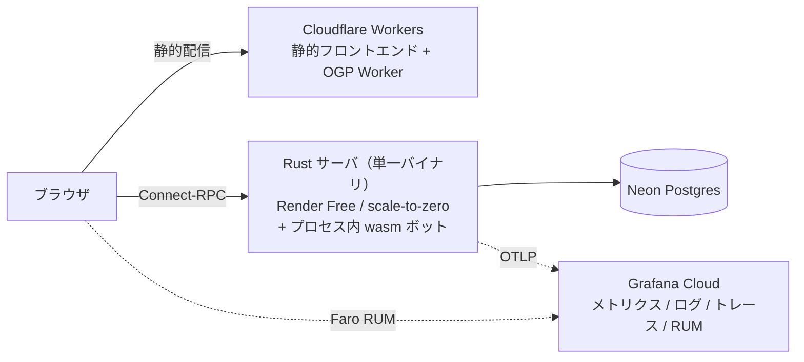

登場人物は 4 つだけです。フロントエンドは完全に静的なファイルとして [Cloudflare Workers](https://workers.cloudflare.com/)（Static Assets）から配信され、ブラウザは [Render](https://render.com/) 上で動く Rust 製の API サーバと [Connect-RPC](https://connectrpc.com/) で直接やり取りします。ゲームの状態は [Neon](https://neon.tech/) Postgres に置き、テレメトリは [Grafana Cloud](https://grafana.com/products/cloud/) に集約。バックエンドは単一バイナリで、CPU（ボット）も別サービスではなくこのプロセスの中で wasm モジュールとして動きます。

そして、この構成を決めた最重要制約が「全部無料枠で運用する」です。非営利ファンプロジェクトなのでランニングコストを完全にゼロにすることは譲れず、Cloudflare Workers も Render も Neon も Grafana Cloud も全部無料枠。この後に出てくる細かい工夫の大半は、この制約から来ています。

## 言語選定

コアは **[Rust](https://www.rust-lang.org/)**、フロントエンドは **TypeScript（[SolidJS](https://www.solidjs.com/)）**、フロントのツールチェインは **[Deno](https://deno.com/)** です。

Rust を選んだ理由は、格好つければ色々あるんですが、本音は「Rust が好きだから」です。AI に全部書かせる以上ぶっちゃけ言語はなんでもよかったし、コンパイルの遅い Rust は試行錯誤のループが遅くなるぶん、むしろ AI 駆動には向いてないんじゃないかとすら思ってます。型というガードレールを強制できるのは強いものの、Go くらいコンパイルが速ければ、テストを AI に書かせてガードレールを固めるやり方もあるしなぁ…と。

とはいえ、結果的には良い選択でした。ボードゲームのエンジンは「不正な状態遷移をさせない」ことが命なので、型で状態機械を縛れる Rust は合っていますし、ネイティブで速い（後述するボットの強さ計測ではフルゲームを毎秒数千ゲーム回します）。そして同じコードを wasm に出せばブラウザでも動くので、「1 つのエンジンをあらゆる場所で使い回す」という後述の構成が自然に組めました。

フロントエンドの SolidJS は、盤面のように細かい状態更新が頻発する UI にリアクティビティの粒度が合っていてランタイムも軽い……というのは後付けで、一番の理由は「思想は大好きなのに利用実績を聞かなすぎて仕事では採用しにくい SolidJS を使ってみたかった」です。個人開発ですから。バックエンドとの通信は Connect-RPC で、proto 定義からフロント・バック双方の型を生成しているので、API の型ズレはビルド時に落ちます。SolidJS と違ってこっちは仕事でもバリバリ採用してる、オススメの構成です。

ツールチェインの Deno は「好きだから」と「応援したいから」でしかありません。ここは本当に Node でも Bun でも、なんでもよかった。

## ゲームエンジン — 1 つの状態機械を全部の場所で使い回す

コアのゲームエンジンは Rust で書かれた純粋なステートマシンです。設計はイベントソーシングで、すべての状態変化は 1 本のパイプラインを通ります。

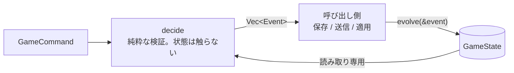

`decide` は状態を一切変更せず「このコマンドで何が起きるか」をイベント列として返すだけで、状態を書き換えられるのは `evolve` ただ 1 つ。カードの効果すら直接状態を触れず、イベントを発行することしかできません。

この縛りの見返りとして、すべての状態遷移がシリアライズ可能・再生可能になります。機能紹介で書いたリプレイは、保存しておいたイベント列を先頭から `evolve` し直しているだけです。リプレイ専用の実装というものがほぼ存在しません。

乱数も全部シード注入できるようにしてあって、同じ（シリーズ・人数・シード）の組からは、山札のシャッフルや途中のリシャッフルまで含めてバイト単位で同一のゲームが再現されます。ウィークリーチャレンジの「全員がまったく同じ展開に挑戦」はこの性質そのものです。

ちなみにこのバイト同一性には罠があって、Rust の `HashMap` は反復順序がプロセスごとに変わるため、マップをそのままビューに流すと反復順序が線に漏れます。CPU の Random 戦略は「合法手リストの n 番目」を選ぶので、順序が変わると **同じシードなのにクライアントごとに CPU が違う手を打つ** ということが起きてしまう。なのでプレイヤーや職場のマップは `BTreeMap` にして、順序を内容由来に固定してあります。

カードは `CardCatalog` トレイトでシリーズごとに差し替えるプラグイン構造で、エンジン本体はカードを知りません。プログレス・メセナ・グローリーの 3 シリーズ対応は、カタログの差し替えで済んでいます。また、エンジンは表示文字列を一切持たず、カードには言語非依存の安定キー（`progress.farm` みたいなやつ）だけを振って、日本語や英語の表示はフロントエンドが解決します。言語切り替えが一瞬なのはこのためです。

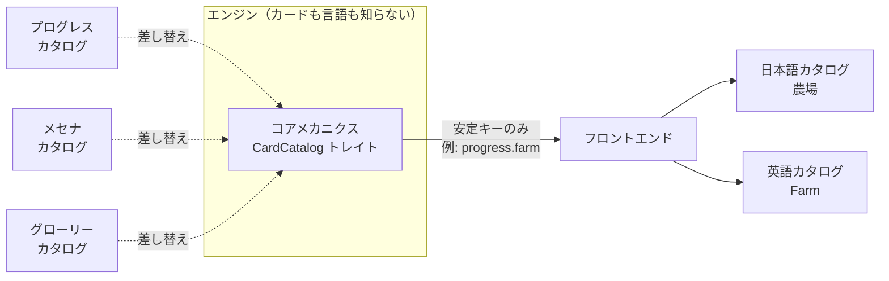

そして、このエンジンが `wasm32` にもネイティブにもコンパイルされます。つまり **同じエンジンがサーバでもブラウザでも動く** 構成です。たとえば前述のチュートリアルは、サーバと一切通信せず、ブラウザの中で本物のエンジンを動かしています。手作りの疑似ゲームで教えるとエンジンの挙動とズレていくので、本物をそのまま持ってくるのが一番確実なんですよね。

これが簡単にできたのは、エンジンが純粋な計算のかたまりだからです。ファイルシステムにもネットワークにも触らず、上で書いたとおり乱数すら外から注入できる設計なので、OS への依存がありません。実際、ビルドされた wasm モジュールはインポートセクションが空で、`WebAssembly.instantiate(bytes, {})` だけで動きます。どこかで I/O に依存していたら、こうはいきませんでした。

## ボット — 差し替え可能な wasm モジュール

CPU（ボット）も `.wasm` モジュールです。ボットの正体は「直列化された `GameView` を受け取って `GameCommand` を 1 つ返す純粋関数」で、エクスポートするのは `alloc` / `dealloc` / `choose_action`（+ panic 用バッファ）だけの素の C ABI。ホストからのインポートはゼロ、I/O もなし、乱数はホストが毎回シードを渡します。おかげで **同じ `.wasm` が 3 つのホストで無改造で動きます。**

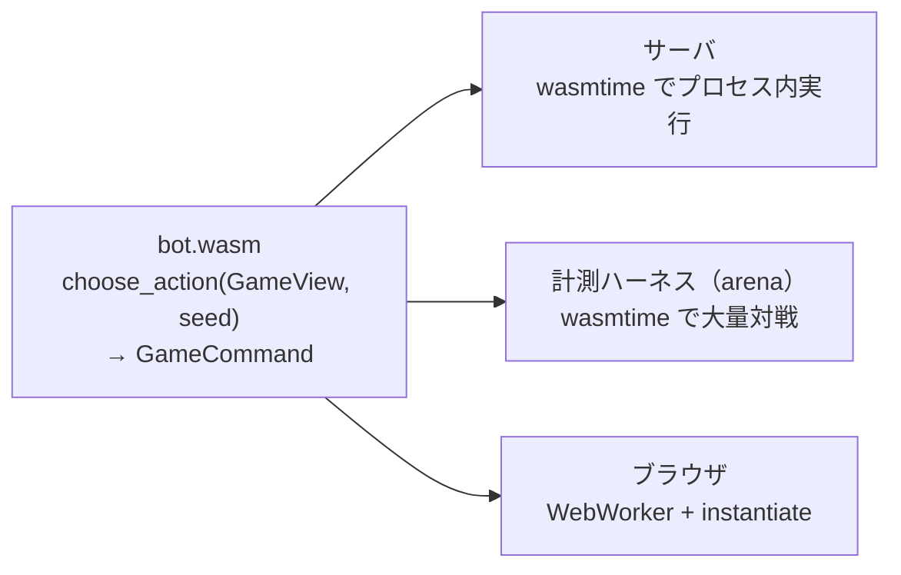

サーバ上では別サービスではなくプロセス内で直接実行されるので、ボット追加 = wasm ファイル追加。デプロイ構成が全く複雑になりません。ブラウザで動かしているのが前述の「代行」では、ボットの `.wasm` をブラウザ内のワーカーに読み込んで、あなたの席の手を打たせています。

地味に大事なのがフェアネスで、ボットに渡る `GameView` は **人間のプレイヤーが画面で見ているのと同じ情報** です。自分の手札は見えるけど、相手の手札や山札は枚数しか分からない。つまり CPU はイカサマできません。★5 が強いのは相手の手札が読めているからではなく、単純に読み（シミュレーション）が深いからです。

「見知らぬ wasm を飼う」ための安全装置も入れてあります。[wasmtime](https://wasmtime.dev/) には [fuel という機構](https://docs.wasmtime.dev/examples-interrupting-wasm.html) があって、命令を実行するたびに残量が減っていき、尽きると実行が中断されます。実時間ではなく命令数で数えるので決定論的に効くのがミソで、これで 1 手あたりの計算量に上限を掛けています。加えてメモリ上限と実時間タイムアウトも設定し、起動時に各モジュールを検疫（probe）して、壊れたものはプールから除外します。この土台があるから、代行ボットの「カスタム」枠で **自作の `.wasm` ボットを持ち込んで戦わせる** ことを安心して許せています。リポジトリの `examples/` にテンプレートがあるので、俺の考えた最強の戦略を Rust で書いて持ち込めます。ABI さえ満たせば TinyGo でも AssemblyScript でも、なんなら手書きの `.wat` でも構いません。

## CPU の強さは「実測」です

土台の話が済んだので、この wasm ボットの中身、つまり本プロジェクトで一番こだわった部分の話をします。このプロジェクトのボットは **強さを全部対戦で実測して、その結果だけを根拠に ★ を付ける** 方針で作っています。せっかくなので、CPU 開発の流れを時系列で振り返ってみます。

### Random から始まるラダー登り

開発は素朴に始まりました。まず、合法手からランダムに選ぶだけの Random を作る。次に Random を倒せる Greedy（目先の得点を最優先する欲張り）を作り、さらにそれを倒せる Tactician を作る。Novice と Planner はその後で、Random < Novice < Greedy、Greedy < Planner < Tactician という「間を埋める難易度」を明確に狙って調整したものです。

ここで問題になるのが「倒せる」の定義です。カードゲームなので運が絡み、数十戦したくらいでは強さの差なんて分かりません。そこで **arena という CLI を作って、アホみたいな回数対戦させる** ことにしました。各ペアに 1000 ゲーム以上叩かせて「統計的に勝ち越している」ことを確認する。これで「倒せる」が雰囲気ではなく数字になりました。出来上がったラダーの隣接勝率がこれです。

| Matchup              | プログレス | グローリー | メセナ |
| -------------------- | ---------- | ---------- | ------ |
| Novice vs Random     | 100%       | 100%       | 100%   |
| Greedy vs Novice     | 60%        | 38%        | 70%    |
| Planner vs Greedy    | 85%        | 67%        | 79%    |
| Tactician vs Planner | 63%        | 44%        | 65%    |

### arena — 「倒せる」を数字にする CLI

その arena はこういう見た目の、「N ゲーム対戦させて JSON で結果を吐く」ことしかしない小さな CLI です。

```bash
./arena --bot tactician.wasm --bot greedy.wasm \
    --series progress --games 200 | jq '.summary'
```

設計のポイントは 2 つあります。まず **完全にブラックボックス** なこと。arena はどの戦略クレートにも依存せず、ボットは `.wasm` ファイルのパスで指定します。ABI を満たしていれば何でも戦わせられるので、改造前後の同じボットを戦わせて強くなったか確かめる、みたいな使い方が再コンパイルなしでできます。ボットがパニックしても wasmtime のストアが落ちるだけで、arena は次の対戦に進みます。

もうひとつは **本物のサーバを埋め込んでいる** こと。対戦のたびにモックを組むのではなく、本番と同じルーム管理をポート 0・TTL 無効の使い捨て構成で起動し、ルーム作成 → ボット着席 → 強制開始という本番と同じ流れを回します。なので計測結果と本番挙動がズレません。あとは `--concurrency` でワーカーを並べてぶん回すだけです。

ちなみに、総当たりや多人数スイープのような特に重い計測には、wasm を介さずエンジンを直接呼ぶネイティブ版のハーネスも用意していて、こちらはフルゲームを毎秒数千ゲーム回せます。

### 「個性」の実験 — 強さでは失敗、面白さで採用

次に狙ったのは Tactician より強いやつです。そこで試したのが「個性」でした。攻撃型・妨害型・守備型のように評価関数の重みを大きく振ったプリセットを作れば、どれかが Tactician を超えるんじゃないか、という実験です。

結果は失敗でした。どの個性も Tactician を安定して超えられず、1 手読みの重み調整はこの帯で頭打ちらしいと分かりました。ただ、思わぬ副産物があって、**個性が入るとゲームが面白い**。相手の欲しい職場を先回りして奪ってくる Saboteur、何があっても黒字を守る Warden、と席ごとに性格が違うと対局の表情がガラッと変わります。なので「Tactician 超え」としては没、「対戦相手のバリエーション」として採用しました。採用した面々がこちらです。

| ★   | Bot        | 傾向                                                              |
| --- | ---------- | ----------------------------------------------------------------- |
| ★3  | Upstart    | 攻撃的・浅い — 労働者を抱え資金も緩いが先読みしない               |
| ★4  | Raider     | 攻撃的 — 大勢の労働者で建設と拡大を押し進める                     |
| ★4  | Saboteur   | 妨害的 — 相手の欲しい職場を奪う                                   |
| ★4  | Warden     | 守備的 — 常に黒字を保ち、多人数戦では自滅する相手を出し抜いて最強 |
| ★4  | Steward    | 守備的 — 資金を守りつつ着実に建物を積む                           |
| ★4  | Mastermind | 均衡 — どれにも偏らない万能型                                     |

この ★ の数字も実測なんですが、測ってみると **ボットの強さは非推移的** で（A が B に勝ち越し、B が C に勝ち越すのに、C が A に勝ち越す、が普通に起きる）、しかも **プレイ人数で順位が入れ替わる** ことが分かりました。たとえば 2 人戦だとバランス型の Mastermind が勝率トップなのに、4 人戦では守備型の Warden が最強になります。周りが賃金の支払いで勝手に苦しみだす多人数戦では、無理をしない奴が最後に生き残るんですね。現実でも聞く話です。

もうひとつ面白かった結果が「先読みの深さは攻撃には効くけど守備には効かない」です。攻撃型は先読みを浅くする（Upstart）と深いもの（Raider）より明確に弱くなるのに、守備型は浅くしても強さがほぼ落ちませんでした。攻めには計画が要るけど、守りは目の前の収支だけ見てれば成立するようです。

こういう性質があるので、単一の対戦カードでは強さを決められません。★ は「2 人総当たり」「3〜4 人戦」「相手の顔ぶれを変えた計測」の 3 通りで相互検証して付けています。全データと考察は [docs/specs/bot_strength.md](https://github.com/unofficial-national-economy/service/blob/main/docs/specs/bot_strength.md) に置いてあります。

### ★5: エンジンを埋め込んで未来予想

個性の実験で「1 手読みの重み調整では Tactician を超えられない」ことがはっきりしたので、Tactician をちゃんと倒すには仕組みから変えるしかありません。そこで試したのが、**wasm コンパイルしたゲームエンジンをボット自身に組み込んで、未来を実際にシミュレートさせる** 実験です。相手の手札や山札は見えないので、公開情報と矛盾しない盤面をランダムに再構成（決定化）し、合法手ごとに終局までのロールアウトを何度も回して、平均スコア差が一番大きい手を打つ、という方式です。

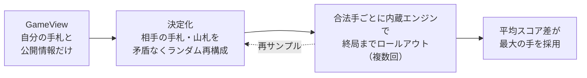

結果は驚異的でした。ラダー最上位の Tactician に 2 人戦で約 95〜99% 勝ち越し。文句なしで採用です。僕はもう勝てる気がしません。

そして、個性が入るとゲームが面白くなることはもう分かっていたので、この探索ボットにも個性を入れました。都合が良いことにこの方式は強さと個性が別々のツマミになっていて、強さはロールアウト回数で、個性は報酬の重み付けで決まります。相手のスコアを下げる手を高く評価すれば攻撃的な Marauder、未払賃金ゼロで終わることを重視すれば慎重な Sentinel、フラットに自分のスコアだけ見れば Virtuoso、という具合です。

ちなみに探索ボットを本格的に作り込む前に、「そもそも 1 手読みの上に伸びしろは残ってるのか」を確認する go/no-go テストを先に書いて、探索方式の優位を確かめてから着手しています。数週間かけて作った結果「重み調整と変わりませんでした」だと悲しすぎるので。

## サーバ — 権威はサーバ、クライアントはダム端末

ボットの話が長くなりました。ここからは、それを配信する側の話です。

サーバは [axum](https://github.com/tokio-rs/axum) + Connect-RPC の単一バイナリで、ゲームの唯一の権威です。クライアントは意図的にダムにしてあって、エンジンを持たず、ルールを知らず、そして信用されていません。手の合法性を判定するのはサーバ内のエンジン（`decide`）だけで、サーバの仕事は「コマンドを中に入れ、イベントを外に配る」ことに徹しています。

「Rust で Connect-RPC ってどうやるの？」と思った方向けに書いておくと、Tower ベースの ConnectRPC 実装である [connectrpc](https://github.com/anthropics/connect-rust) クレートにサービス実装を register して、axum のルーターに変換して載せています。proto のメッセージ型を生成しているのは、pure Rust の Protocol Buffers 実装である [buffa](https://github.com/anthropics/buffa)。connectrpc は gRPC reflection を実装していないので、そこだけ [tonic](https://github.com/hyperium/tonic) の reflection サービスを 1 ルートだけ同居させて、grpcurl のようなツールからスキーマを引けるようにしています。

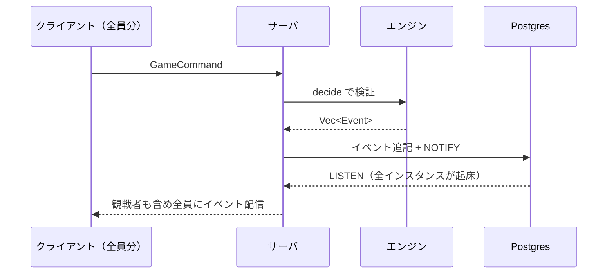

認証はアカウントなしのトークンベースです。ルーム作成時のオーナートークンと席ごとのプレイヤートークンがあるだけで、これが前述の「LocalStorage に保存される内部 ID」の正体。トークンを失えば席を失う潔い設計ですが、切断には猶予時間があり、時間内に戻れば復帰、超えると CPU が席を引き継いでゲームを続けます。対人ルーム向けにはパスフレーズ、拒否リスト、レートリミットといった荒らし対策も一通り入っています。

ストレージは `RoomStore` / `SessionStore` トレイトで抽象化していて、インメモリ（`DashMap`）と Postgres の 2 バックエンドを同じハンドラで扱えます。本番は Postgres で、ゲームの状態はエンジンのイベント列として永続化されるので、**サーバが再起動しても進行中のゲームは失われません**。これは趣味ではなく必須要件で、というのも本番は **Render の Free プラン**、つまりアクセスが途切れるとインスタンスが眠る scale-to-zero だからです。

とはいえ対局の真っ最中に眠られると困るので、**人間のゲームが 1 つでも進行中の間だけ、サーバが自分の公開 URL を定期的に self-ping して眠らないようにする** 仕組みを入れました。ゲームが終われば ping も止まり、素直に眠って無料枠を節約します。

ちなみに、インスタンス間の通知に Postgres の `LISTEN/NOTIFY` を使っているのは、無料でやる以上メッセージキューを別立てできなかったから、というのが一番の理由です。既にいる Postgres に通知係も兼ねてもらうのが一番安い。まぁ、この規模で専用の通知基盤を入れるほどでもない、というのもありますが。

ただ、ここには細かい罠があって、通常のクエリは Neon のプール接続（実体は [PgBouncer](https://www.pgbouncer.org/) のトランザクションプーリング）経由なんですが、PgBouncer は `LISTEN/NOTIFY` を通せません。なのでこの用途のためだけに direct 接続を 1 本だけ別に張る、という二本立てにしています。

## フロントエンド — 完全静的 + DESIGN.md

フロントエンドは SolidJS + [Tailwind CSS](https://tailwindcss.com/) を SSG でビルドして、Cloudflare Workers（Static Assets）から配信しています。サーバサイドレンダリングは一切なく、エッジで動的なことをするのは後述の OGP だけです。

SSG の中身はこうなっています。全ページが `/[lang]/` 配下にあるので、ロビーやチュートリアルのような固定ルートは `/ja/` と `/en/` で 2 回ずつプリレンダリングされ、言語ごとの `<head>`（`lang` 属性、`og:*`、canonical、hreflang）が各 HTML に焼き込まれます。一方でルーム URL のような動的ルートはプリレンダリングせず、静的ホストの SPA フォールバックでルートのシェルを返して、あとはクライアント側でルーティングします。

API サーバの URL はビルドに焼き込んでいません。`config.js` という古典的な `<script>` を `<head>` で読み込んで `globalThis.__APP_CONFIG__` に注入する方式で、本番・ローカル・E2E すべてが同一バンドルを使い、`config.js` だけを環境ごとに差し替えます。「環境の数だけビルドする」をやらずに済むやつです。

細かいパフォーマンスネタもひとつ。SSG は `lobby/index.html` の形でファイルを吐くので、素朴に配信すると `/lobby` へのアクセスが `/lobby/` に 301 リダイレクトされます。このリダイレクト 1 ホップが遅い回線だと地味に痛いと [Lighthouse](https://developer.chrome.com/docs/lighthouse/overview) に怒られたので、Cloudflare 側の設定でトレイリングスラッシュ無しのまま同じファイルを直接返すようにしています。まぁぶっちゃけカードゲームなので、パフォーマンスはあまりシビアに見てないですが。そもそもサーバーが寝てると、起きるのを 30〜60 秒待たなきゃいけないですしね。

デザイン面では [DESIGN.md スペック](https://github.com/google-labs-code/design.md) を採用していて、色やタイポグラフィの定義を `DESIGN.md` という 1 ファイルに集約し、そこから Tailwind v4 の `@theme` 形式のデザイントークン CSS を自動生成しています。生成された CSS はコミットする運用で、CI が「定義と生成物のズレ」と「定義そのものの品質」を両方見張ります。

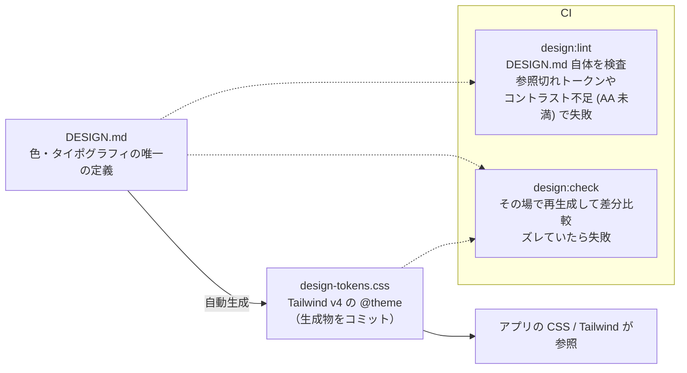

`design:check` は CI 上でトークン CSS を再生成して、コミットされているものと差分が出たら落とす仕組みです。「`DESIGN.md` だけ直して CSS の再生成を忘れた」が絶対に main に入りません。`design:lint` の方は `DESIGN.md` 自体の検査で、どこからも参照されていないトークンや、コントラスト比が WCAG AA に届かない色の組み合わせを警告ごと **ハードエラー扱い** にしています。例外は理由付きの許可リストに載せた項目だけ。デザイン定義が「なんとなく腐っていく」のを CI で止める構えです。

あとブラウザバンドルは「頒布物」なので、ライセンス開示も自動化してあります。ビルド時に、バンドルへ入った全 npm パッケージとそのライセンス全文を列挙した `oss-licenses.txt` を生成して一緒に配布し、強コピーレフト（GPL / AGPL）のライセンスを検出したらビルドごと失敗させるゲートも掛けています。うっかり混入すると、フロントエンド全体がそのライセンスに従う羽目になるので。

## 動的 OGP — エッジで対局結果を画像にする

結果ページやウィークリーチャレンジの URL を X などに貼ると、対局内容に応じた OGP 画像が生成されます。担当するのは Cloudflare Workers 上の小さな Worker です。

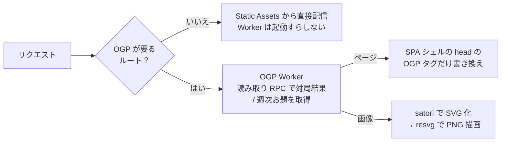

まずルーティング。Worker を経由するのは OGP が必要なルートだけで（`run_worker_first` に列挙）、それ以外のアクセスは Static Assets から直接配信され、Worker は起動すらしません。Workers 無料枠の呼び出し回数を、本当に必要なリクエストのためだけに取ってあります。

Worker の仕事は 2 つです。1 つはページの `<head>` 書き換えで、SPA のシェル HTML を取ってきて OGP タグ（タイトル・説明・`og:image`）だけを差し替えて返します。本文もスクリプトもそのままなので、人間が開けば普通に SPA が起動する。もう 1 つが `og:image` の PNG 生成本体です。

PNG 生成は、カードのレイアウトを JSX 風のツリーで書いておき、[satori](https://github.com/vercel/satori) が SVG に変換（レイアウト計算は [yoga](https://www.yogalayout.dev/)）、[resvg](https://github.com/thx/resvg-js) がそれを PNG にラスタライズする、という流れです。satori も yoga も resvg も wasm モジュールで、vendored したバイナリを Worker のバンドルに同梱して読み込むので、実行時のネットワークフェッチはありません。ここでも wasm が働いてます。

日本語フォントには罠がありました。satori は可変フォント（variable font）を読めないので、アプリ本体で使っている [Noto Sans JP](https://fonts.google.com/noto/specimen/Noto+Sans+JP) がそのまま使えません。CJK サブセット化した静的インスタンスを 3 ウェイトぶん生成してコミットし、OGP 描画専用に配信しています。

キャッシュも内容に合わせていて、終局した対局の結果カードは二度と変わらないので `immutable` で 1 年、ウィークリーのカードはランキングが動くので 5 分にしています。

## テスト — レイヤーごとに道具を分ける

まずエンジン。シリーズごとのシナリオテスト（ルールブック由来の局面を再現して結果を検証するやつ）が 3 シリーズぶんあり、加えて [proptest](https://github.com/proptest-rs/proptest) による property-based テストで「どんな手順を踏んでもゲームの不変条件が壊れない」ことを検証しています。イベントソーシングで状態遷移が 1 本道なので、この手のテストがとても書きやすい。ボットの計測ハーネスも `#[ignore]` 付きのテストとして書かれているので、`cargo test` の延長で CPU 節に載せた勝率表を再現できます。

RPC レベルのシナリオテストには拙作の **Probitas** を使っています。API・データベース・メッセージキューを対象にしたシナリオベースのテストフレームワークで、HTTP / gRPC / Connect RPC / GraphQL から PostgreSQL・MongoDB・Redis・RabbitMQ・SQS まで、10 種類以上のクライアントを最初から内蔵しています。`scenario().step()` のメソッドチェーンでシナリオを宣言的に組み立てる書き味で、リソースは一度定義すればステップ間で共有されてクリーンアップまで面倒を見てくれる。`expect()` はレスポンスの型を見て適切なアサーションに切り替わり、全部型付きで補完が効きます。あと `llms.txt` に対応させているので、AI にシナリオを書かせるのも得意です。

このプロジェクトでは Connect RPC を直接叩いて、正常系に加えて「無効な引数で INVALID_ARGUMENT が返るか」みたいな異常系のステータスコードまで検証しています。ブラウザを起動する Playwright と違って API テストを高速に回せるので、API サーバーが分離されているマイクロサービス的な構成だと非常に強力です。実際、仕事でもめちゃめちゃ使ってます。こういう API のシナリオテストを書きたい場面があれば、ぜひ試してみてください。

https://probitas-test.github.io/

ブラウザ E2E は **[Playwright](https://playwright.dev/)** です。Probitas だけだとフロントエンドのバグは検知できないので、その補完として使っています。トップ・ロビー・対局・チュートリアル・代行に加えて、切断・404・パスフレーズ・古いトークンといったエラー系、iPhone 向けのモバイル操作系まで一通りスペックがあります。ただ Playwright は遅いので、Probitas で検証できるものはなるべく Probitas 側に寄せる方針です。

そして CI では、この E2E を「本番に出るものそのもの」に対して回します。

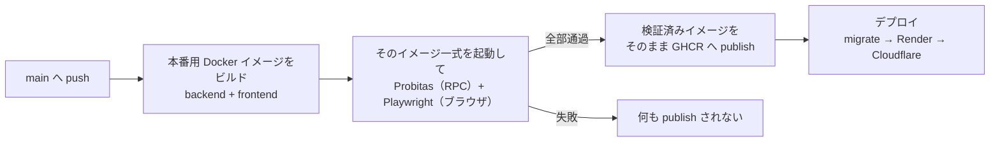

ビルドは 1 回だけで、E2E を通ったイメージがバイト単位でそのまま本番に行きます。「テストした物とデプロイした物が微妙に違う」問題が構造的に起きません。

## 運用 — 個人開発でもオブザーバビリティ

監視は **Grafana Cloud** に集約しています。

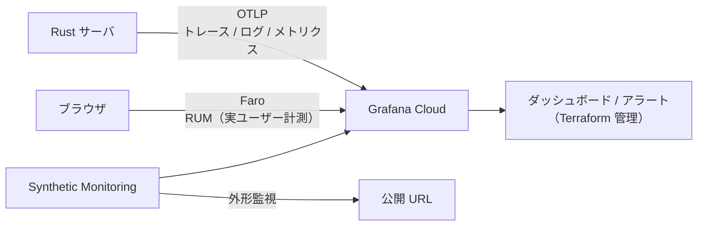

サーバは OTLP でトレース・ログ・メトリクスを送り、ブラウザ側は Faro で実ユーザーの挙動やエラーを拾い、Synthetic Monitoring が外から公開 URL を定期的に叩きます。scale-to-zero でサーバが寝ている時間があるサービスなので、「外から見て生きているか」を測る外形監視が地味に効きます。ダッシュボードやアラートの定義も [Terraform](https://developer.hashicorp.com/terraform) 管理で、手作業でポチポチ作った監視が壊れて誰も気付かない、という定番の悲劇を避けています。

インフラの役割分担は「**デプロイは [GitHub Actions](https://github.com/features/actions)、Terraform は動きの遅い土台だけ**」です。Terraform が持つのは Neon プロジェクトや Grafana Cloud 一式といった滅多に変わらないリソースで、PR で plan が走り main マージで apply。インフラ変更もコードレビューに乗ります。ステートの置き場所は HCP Terraform の無料枠です。ここもタダ。

正直な継ぎ目もひとつ白状しておくと、Render のサービス本体だけは Terraform 管理ではなく手動管理です。Terraform プロバイダに無料枠のサービスを更新できないバグがあって（[upstream issue](https://github.com/render-oss/terraform-provider-render/issues/80)）、回避不能でした。代わりに環境変数の同期だけ専用 API 経由でデプロイワークフローに組み込んで、非シークレット値はリポジトリの JSON で版管理しています。IaC 原理主義に殉じるより、ダメなところは素直に手で持つ方針です。

ここまで含めて全部無料枠なので、「趣味の対戦ゲームサーバをタダで運用する」構成としては結構参考になるんじゃないかと思います。ただ、カードゲームなのでリアルタイム性があまり要求されないこと、裏側の計算が複雑ではないこと、Rust なので CPU もメモリも食わないこと、あたりに助けられて成立している構成でもあります。

# AI 駆動開発

このプロジェクトは **Claude Code をフル活用して開発** しています。開発期間は約 2 ヶ月、コミット数は 700 超、そのうち 4 割弱が Claude との共著コミットです。仕事が終わってからの時間や土日を溶かしながら、急がずのんびり開発していました。

最初にやったのは、所有しているナショナルエコノミーのデジタル化です。全カードと説明書を写真に撮り、OCR に掛けて生のテキストを取り出し、整形した Markdown として書き出す。その Markdown を何度も自分で読んでは細かい間違いを直して、開発の基準となる「ルールブック」にまとめました。テストの節で書いた「ルールブック由来のシナリオテスト」の元ネタはこれです。

ちなみに、二次創作の対象はあくまで「ルール」そのものだけなので、取り込んだ写真や OCR の生データはこの時点ですべて破棄しています。以降の開発は、抽出したルールブックのみに依存して進めました。また、これは問題ない気もしますが、生成したルールブックを単体で配布すると二次配布に抵触する恐れがあるかもな？と思ったので、ルールブックだけは別のプライベートリポジトリに分けて管理しています（公開リポジトリからは submodule 参照）。

コードだけじゃなく、カードや背景のアートワークも AI 生成です。僕は絵がダメダメなので、少し前なら「ボードゲームの Web 実装」なんて UI の見た目の時点で詰んでいました。良い時代です。

AI と一緒に 13 万行のコードベースを回すために効いたのは、ありきたりですが **仕様書を単一の情報源にする** 運用でした。`docs/specs/` に各クレートの設計意図（なぜこの形なのか）を書いた仕様書が 26 本あって、コードを変えたら同じ変更で仕様書も更新することをリポジトリのルールとして強制しています。仕様が腐らないので、AI が次のタスクに入るときの文脈として毎回使えます。この記事を書くにあたっての情報源も大体これでした。

全体の流れを図にするとこうなります。

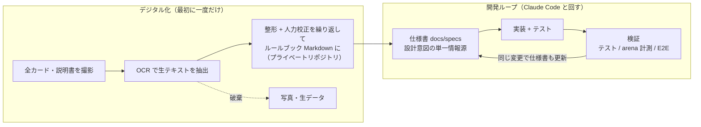

`.claude/` 以下にはプロジェクト固有の道具も置いてあります。たとえば新しいボットを追加する定型手順を焼いたスキル（`bot-new`）、対戦計測の回し方を焼いたスキル（`arena-run`）、仕様書やデザイントークンの同期を促すルール群です。ボットの強さ計測のような「対戦を大量に回して勝率表とレーティングを更新する」作業は、手でやると心が折れる量ですが、AI エージェントに任せると黙々とやってくれます。まさに向いてる仕事でした。

# さいごに

「ナショナルエコノミーをオンラインで遊びたい」という個人的な欲求から始まったプロジェクトですが、気付いたら探索ボットの強さをレーティングしたり Terraform を書いたりしていました。個人開発あるあるですね。

繰り返しになりますが、本サービスは非公式・非営利のファンメイド作品です。このゲームを気に入ったら、ぜひ [コロコロ堂さんの復刻版](https://korokorodou.com/archives/products/national-ecnomy)（三部作全部入り）を買って卓を囲んでください。長い絶版期間を経てせっかく普通に買えるようになったんです。物理で遊ぶナショナルエコノミーが一番面白いです。

まずは CPU 相手に 1 ゲームやってみてください。一緒に遊べる友達がいない人でも遊べるように、ウィークリーチャレンジなどもあるので是非。僕の名前しか載ってないランキングだと悲しいので、ほんと、まじで。

あと、本番は不定期に突然更新します。ゲーム中に更新が走ると対局が中断されちゃったりしますが、趣味の無料運営なのでそこは許容してください。

https://unofficial-national-economy.lambdalisue.workers.dev/

不具合報告や機能のご要望は、お問い合わせ用のリポジトリで受け付けています。

https://github.com/unofficial-national-economy/contact
